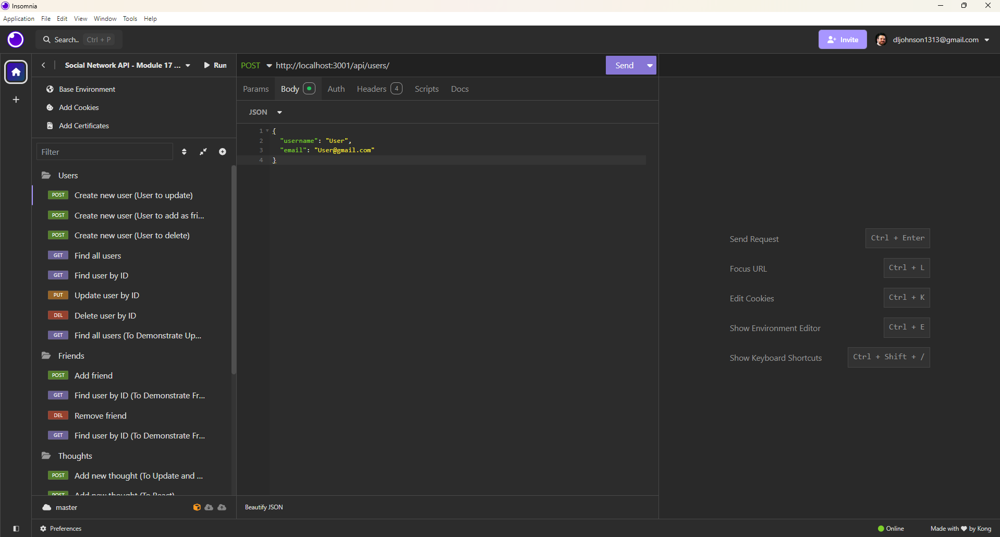

# socialNetworkAPI [](https://opensource.org/licenses/MIT)
            
## Description
<p>An application designed to practice API routing to interact with MongoDB database using mongoose and Express to perform CRUD operations with users, thoughts, and reactions (as a subdocument of thoughts) in a fashion similar to most popular social media applications.</p>
            
## Table of Contents
- [Installation](#installation)
- [Usage](#usage)
- [Credits](#credits)
- [Testing](#testing)
- [Questions](#questions)
- [License](#license)
            
## Installation
<p>In order to utilize this application, you need to install Node.js, MongoDB, and software to test API routes such as Insomnia or Postman.</p>

<p>To start your server, copy this repository to your local machine and use the cd command to enter the route directory and use "npm run start" to create a dist folder where the TypeScript files will be compiled into JavaScript. The server should start up (you will see a console log showing which port the server is listening on), and then you can use your API testing software to test the different request types at the endpoints listed below.</p>


            
## Usage
<p>This application was practice for building the backend functions of a social media network by starting a server, connecting to a MongoDB database, and performing CRUD operations to interact with that database by creating, updating, finding and deleting users, thoughts and reactions to those thoughts. The routes being tested are listed below. The server is defaulted to run at http://localhost:3001/ - adjust as necessary if using a different port.</p>

<h2>/api/users/</h2>
<ul>
<li>POST request - Create new user. Must be sent with JSON body data of username and email, for example:

``` JSON
    {
    "username": "User",
    "email": "account@email.com"
    }
```
</li>
<li>GET request - View all users</li>
</ul>

<h2>/api/users/:userId</h2>
<p>:userId is the unique _id assigned to each user upon creation. It is returned in the GET request to view all user information.</p>
<ul>
<li>GET request - View user with _id of userId</li>
<li>DELETE request - Delete user with _id of userId</li>
<li>PUT request - Update user data. Must be send with JSON body data of the new username and/or email, for example:

``` JSON
    {
    "username": "UpdatedUser",
    "email": "UpdatedAccount@email.com"
    }
```
</li>
</ul>

<h2>/api/users/:userId/friends/:friendId</h2>
<p>userId is the _id of the user adding a friend, and friendId is the _id of the user they are adding as a friend
<ul>
<li>POST request - Add friend to friends list</li>
<li>DELETE request - Delete friend from friends list</li>
</ul>

<p>/api/thoughts/</p>
<ul>
<li>GET request - View all thoughts</li>
<li>POST request - Create new thought. Must be sent with JSON body data containing thoughtText, username, and user_id. For example:

``` JSON
{
    "thoughtText": "Your thought here.",
    "username": "User",
    "user_id": "Use _id obtained from /api/users GET request"
}
```
</li>
</ul>

<h2>/api/thoughts/:thoughtId</h2>
<p>:thoughtId is the unique _id assigned to each thought, it can be found in the data returned by the GET request to view all thoughts
<ul>
<li>GET request - View thought</li>
<li>DELETE request - Delete thought</li>
<li>PUT request - Update thought text. Must be sent with JSON body containing the new thoughtText, for example:

``` JSON
{
    "thoughtText": "Insert the text you would like the thought to be updated to here."
}
```

</li>
</ul>

<h2>/api/thoughts/:thoughtId/reactions/:reactionId</h2>
<p>reactionId is the unique _id assigned to each reaction. This can be found by viewing the data returned in the GET request for the associated thought.</p>
<ul>
<li>DELETE request - Delete reaction</li>
<li>POST request - Create reaction. Must be sent with JSON body with the reaction text, for example:

``` JSON
{
    "reaction": "This is my reaction!"
}
```

</li>
</ul>

## Credits

### Author
<p>Devyn Johnson | <a href="https://github.com/DevynJohnson">Github Profile</a> | <a href="https://devynjohnsonportfolio.netlify.app/"> Portfolio</a></p>
        
### Collaborators and Contribution Instructions

<p>If you would like to contribute to this project, please <a href="mailto:dljohnson1313@gmail.com">email me</a>.</p>
            
### Third-Party Assets
<p>MongoDB | <a href="https://www.mongodb.com/">https://www.mongodb.com/</a></p><p>mongoose | <a href="https://www.npmjs.com/package/mongoose">https://www.npmjs.com/package/mongoose</a></p><p>Express | <a href="https://www.npmjs.com/package/express">https://www.npmjs.com/package/express</a></p><p>Insomnia | <a href="https://insomnia.rest/">https://insomnia.rest/</a></p>

## Testing
<p>If you experience any issues, please reach out to dljohnson1313@gmail.com or open an issue on the Github repository and I would be happy to try and help resolve it. Please include a detailed description of the issue, along with specific error details if they are available.</p>

## Questions
<p>For questions, see my profile at <a href="https://github.com/DevynJohnson">Github</a> or <a href="mailto:dljohnson1313@gmail.com">email me</a>.</p>
            
## License
<p>MIT License

Copyright (c) 2025 Devyn Johnson

Permission is hereby granted, free of charge, to any person obtaining a copy
of this software and associated documentation files (the "Software"), to deal
in the Software without restriction, including without limitation the rights
to use, copy, modify, merge, publish, distribute, sublicense, and/or sell
copies of the Software, and to permit persons to whom the Software is
furnished to do so, subject to the following conditions:

The above copyright notice and this permission notice shall be included in all
copies or substantial portions of the Software.

THE SOFTWARE IS PROVIDED "AS IS", WITHOUT WARRANTY OF ANY KIND, EXPRESS OR
IMPLIED, INCLUDING BUT NOT LIMITED TO THE WARRANTIES OF MERCHANTABILITY,
FITNESS FOR A PARTICULAR PURPOSE AND NONINFRINGEMENT. IN NO EVENT SHALL THE
AUTHORS OR COPYRIGHT HOLDERS BE LIABLE FOR ANY CLAIM, DAMAGES OR OTHER
LIABILITY, WHETHER IN AN ACTION OF CONTRACT, TORT OR OTHERWISE, ARISING FROM,
OUT OF OR IN CONNECTION WITH THE SOFTWARE OR THE USE OR OTHER DEALINGS IN THE
SOFTWARE.</p>
<p>License Information: <a href="https://opensource.org/licenses/MIT">https://opensource.org/licenses/MIT</a></p>